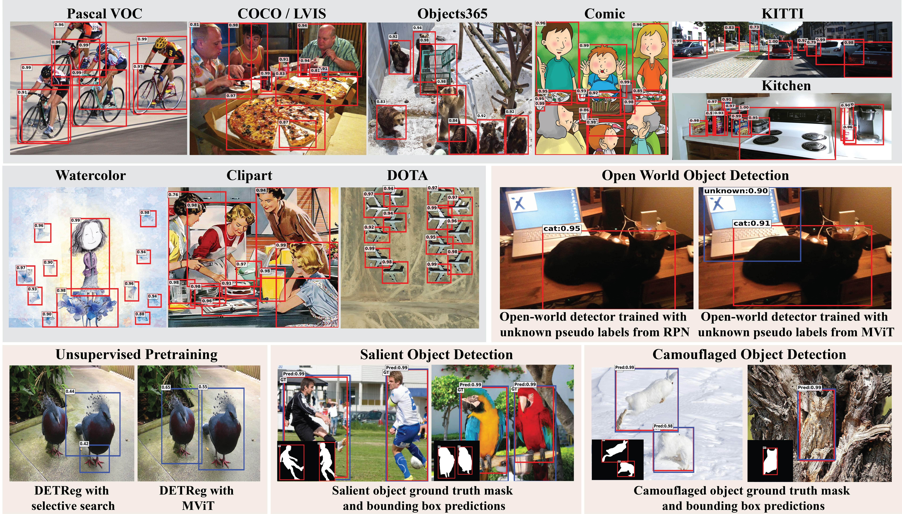
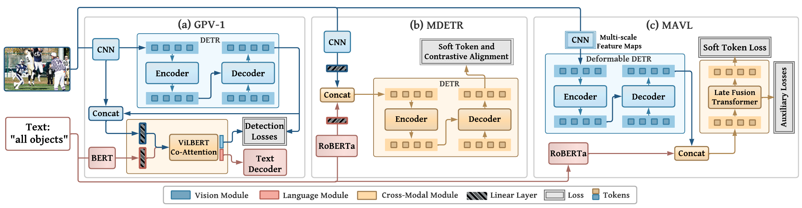
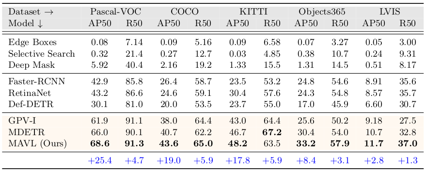
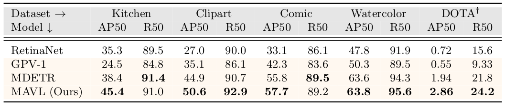
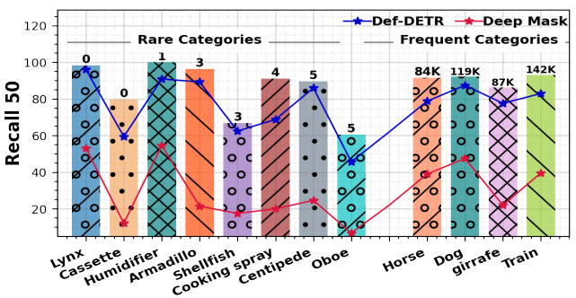
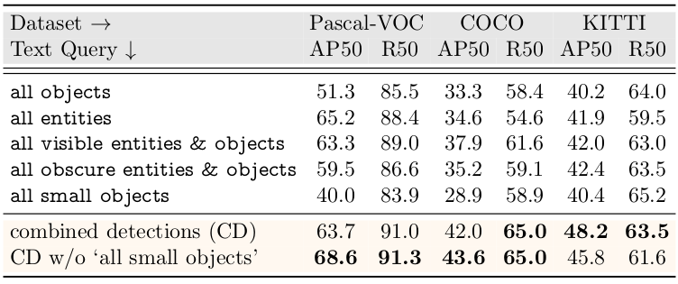
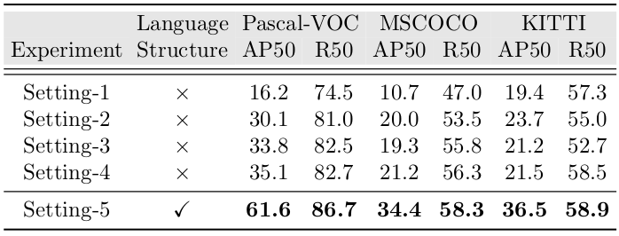
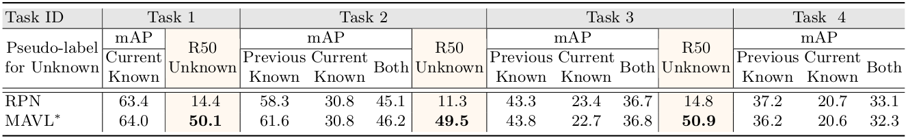
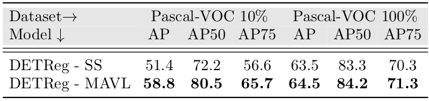

# Class-agnostic Object Detection with Multi-modal Transformer (ECCV 2022)


> *<div style="text-align: justify"> **Abstract:** What constitutes an object? This has been a long-standing question in computer vision. Towards this goal, numerous learning-free
and learning-based approaches have been developed to score objectness. However, they generally do not scale well across new domains and novel
objects. In this paper, we advocate that existing methods lack a top-down supervision signal governed by human-understandable semantics.
For the first time in literature, we demonstrate that Multi-modal Vision Transformers (MViT) trained with aligned image-text
pairs can effectively bridge this gap. Our extensive experiments across various domains and novel objects show the 
state-of-the-art performance of MViTs to localize generic objects in images. Based on the observation that existing
MViTs do not include multi-scale feature processing and usually require longer training schedules, we develop an efficient MViT architecture using
multi-scale deformable attention and late vision-language fusion. We show the significance of MViT proposals in a diverse range of applications
including open-world object detection, salient and camouflage object detection, supervised and self-supervised detection tasks. Further, MViTs
can adaptively generate proposals given a specific language query and thus offer enhanced interactability. </div>*

<hr />

## Architecture overview of MViTs used in this work
Architecture overview of MViTs used in this work – [GPV-1](https://arxiv.org/abs/2104.00743),
[MDETR](https://openaccess.thecvf.com/content/ICCV2021/papers/Kamath_MDETR_-_Modulated_Detection_for_End-to-End_Multi-Modal_Understanding_ICCV_2021_paper.pdf)
and Multiscale Attention ViT with Late fusion (MAVL) (ours).


<hr />

## Installation
The code is tested with PyTorch 1.8.0 and CUDA 11.1. After cloning the repository, follow the below steps for installation,

1. Install PyTorch and torchvision
```shell
pip install torch==1.8.0+cu111 torchvision==0.9.0+cu111 -f https://download.pytorch.org/whl/torch_stable.html
```
2. Install other dependencies
```shell
pip install -r requirements.txt
```
3. Compile Deformable Attention modules
```shell
cd models/ops
sh make.sh
```
<hr />

## Results
Results of Class-agnostic Object Detection of MViTS including our proposed Multiscale Attention ViT with Late fusion
(MAVL) model, applications, and exploratory analysis.

<strong>Class-agnostic Object Detection</strong> performance of MViTs in comparison with bottom-up approaches and uni-modal detectors on five natural image OD datasets. MViTs show consistently good results on all datasets.



<hr />

<strong>Generalization to New Domains</strong>: Class-agnostic OD performance of MViTs in comparison with uni-modal detector(RetinaNet) on five out-of-domain OD datasets. MViTs show consistently good results on all datasets.



<hr />

<strong> Generalization to Rare/Novel Classes</strong>: MAVL class-agnostic OD performance on rarely and frequently occurring categories in the pretraining captions.
The numbers on top of the bars indicate occurrences of the corresponding category in the training dataset.
The MViT achieves good recall values even for the classes with no or very few occurrences.



<hr />

<strong> Enhanced Interactability</strong>: Effect of using different <strong>intuitive text queries</strong> on the MAVL class-agnostic OD performance.
Combining detections from multiple queries captures varying aspects of objectness.



<hr />

<strong> Language Skeleton/Structure</strong>: Experimental analysis to explore the contribution of language by removing all textual inputs, but maintaining the structure introduced by captions. 
All experiments are performed on Def-DETR. 
In setting 1, annotations corresponding to same images are combined. 
Setting 2 has an additional NMS applied to remove duplicate boxes. 
In setting 3, four to eight boxes are randomly grouped in each iteration. 
The same model is trained longer in setting 4. 
In setting 5, the dataloader structure corresponding to captions is kept intact. 
Results from setting 5 demonstrate the importance of structure introduced by language.



<hr />

<strong> Open-world Object Detection</strong>: Effect of using class-agnostic OD proposals from MAVL for pseudo labelling of unknowns in Open World Detector (ORE).



<hr />

<strong> Pretraining for Class-aware Object Detection</strong>: Effect of using MAVL proposals for pre-training of DETReg instead of Selective Search proposals.



<hr />

## Citation
If you use our work, please consider citing:
```bibtex
    @inproceedings{Maaz2022Multimodal,
      title={Class-agnostic Object Detection with Multi-modal Transformer},
      author={Maaz, Muhammad and Rasheed, Hanoona and Khan, Salman and Khan, Fahad Shahbaz and Anwer, Rao Muhammad and Yang, Ming-Hsuan},
      booktitle={17th European Conference on Computer Vision (ECCV)},
      year={2022},
      organization={Springer}
}
```